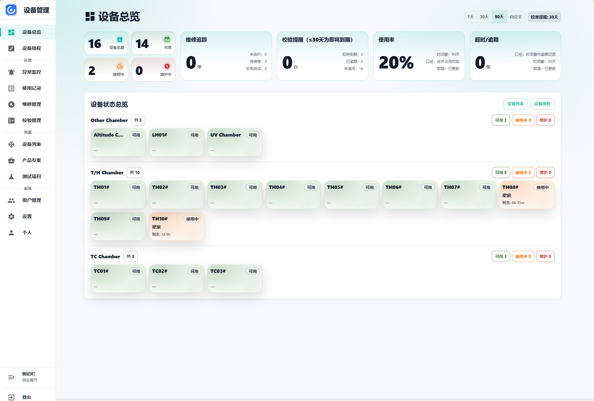
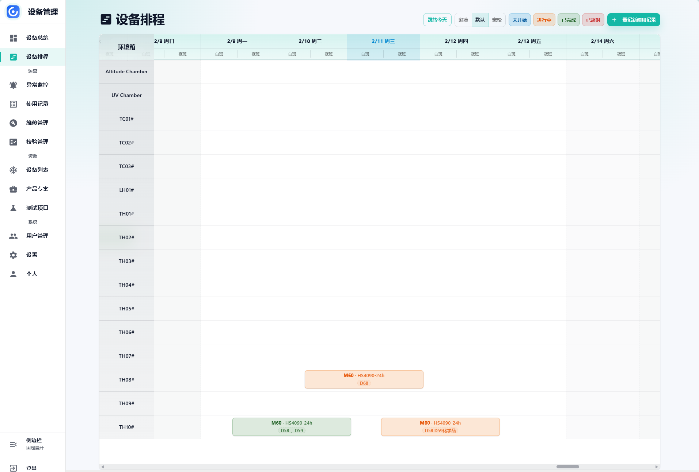
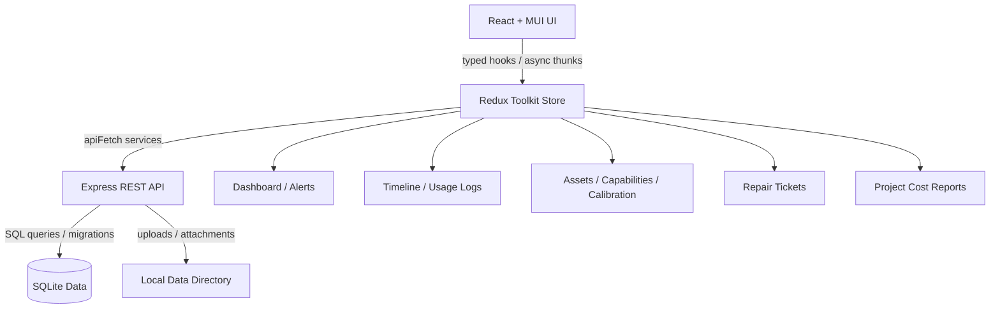

> [!IMPORTANT]
> **Vibe Coding 说明 / Disclaimer**
>
> 本仓库是作者在 AI 辅助下以 **vibe coding** 方式完成的个人作品：主要通过自然语言描述需求、由 AI 生成和修改代码，作者负责产品想法、体验验证和方向取舍。作者不是专业开发者，也不具备系统的代码审计能力；代码按现状提供，请在使用、部署或二次开发前自行审查、测试并承担相应风险。

<p align="center">
  
</p>

<h1 align="center">Chamber Tracker 设备资产管理平台</h1>

<p align="center">
  <a href="https://react.dev">
    
  </a>
  <a href="https://vitejs.dev">
    
  </a>
  <a href="https://www.typescriptlang.org">
    
  </a>
  <a href="LICENSE">
    
  </a>
</p>

> **Chamber Tracker** 是一套面向实验室、可靠性测试团队与设备共享场景的**设备资产与占用管理系统**。
>
> 核心目标是：把环境箱等关键设备的资产档案、使用排期、维修校准、项目成本与异常告警聚合到同一个工作台，让团队可以清楚知道**设备在哪里、谁在用、何时归还、是否可用、成本如何沉淀**。

---

## 📸 应用预览

### 1. 设备健康度与异常概览


### 2. 可视化设备占用时间线


---

## 🌟 核心特性

- 📊 **资产状态统一看板**
  将可用、使用中、维护中、校准过期、超长占用等关键状态集中展示，帮助团队快速判断设备池健康度。
- 📅 **甘特式占用时间线**
  以设备维度展示使用记录，支持查看占用区间、创建记录、结束占用，并与资产当前状态自动联动。
- 🧾 **使用记录驱动状态**
  系统通过使用记录判断设备是否正在被占用，并在拉取记录后自动对账设备状态，减少人工维护带来的漂移。
- 🛠️ **维修与校准闭环**
  支持维修询价、待维修、维修中、完成等流程，配合校准日期追踪，在设备不可用或即将过期时提前暴露风险。
- 🧪 **测试项目与资产能力管理**
  可维护测试项目、温湿度条件、阶段配置、资产能力参数与设备分类，让排期和项目执行有更稳定的上下文。
- 💰 **项目成本报表**
  基于设备小时费率、占用时长与快照数据沉淀项目成本，支持后续统计、复盘与归档。
- 🔐 **角色与审计**
  提供登录、用户角色、管理员入口与审计记录，适合团队内部多人协作使用。
- 📤 **数据导出与附件管理**
  支持使用记录导出、资产图片/铭牌/附件维护，让设备资料和测试过程材料集中保存。

---

## 🏗️ 架构与数据流

Chamber Tracker 采用 React + Redux Toolkit 的前端应用壳，配合 Express + SQLite 后端提供轻量 REST API。前端负责工作台、表单、时间线与报表交互；后端负责认证、资产、使用记录、维修单、项目、事件与文件服务。



### 核心模块

- **`src/pages/`**：业务页面，包括 Dashboard、Timeline、资产详情、维修、项目、成本报表、设置与用户管理。
- **`src/components/`**：跨页面复用组件，包括布局、导航、表单、列表、时间线与图表容器。
- **`src/store/`**：Redux slices、异步 thunks 与选择器，承载前端业务状态。
- **`src/services/`**：前端 API 服务封装，以及资产状态对账等业务服务。
- **`src/utils/`**：状态判断、时间处理、导出等工具函数。
- **`backend/src/http/routes/`**：后端 REST 路由，覆盖资产、使用记录、维修单、项目、报表、文件、用户与系统设置。
- **`backend/src/services/`**：后端审计、事件、成本快照、资产状态与文件夹等领域服务。

---

## 🧭 业务工作流

### 1. 资产建档
维护设备名称、编码、分类、位置、制造商、型号、序列号、负责人、小时费率、能力参数、照片、铭牌与附件。

### 2. 排期与占用
通过使用记录绑定设备、项目、测试配置、开始时间与结束时间。系统会根据记录状态判断设备是否被占用，并在 Dashboard 与 Timeline 中同步反映。

### 3. 维修与校准
设备进入维修流程后可记录供应商、报价、预计返还日期、完成时间与附件；校准日期用于提前发现过期风险。

### 4. 成本沉淀
使用记录会保留费率、计费时长与成本快照，项目成本报表可以按项目维度汇总设备使用成本。

---

## 📂 项目结构规划

```text
chamber-tracker/
├── src/                         # React 前端源码
│   ├── components/              # 通用 UI 组件与业务组件
│   ├── pages/                   # 路由页面
│   ├── services/                # API 请求与前端业务服务
│   ├── store/                   # Redux Toolkit slices / thunks / selectors
│   ├── utils/                   # 状态判断、导出、格式化等工具
│   └── types.ts                 # 前端共享领域类型
├── backend/                     # Express + SQLite 后端
│   └── src/
│       ├── db/                  # SQLite 连接与迁移
│       ├── http/                # Express app、中间件与 REST routes
│       ├── services/            # 后端领域服务
│       └── util/                # 后端通用工具
├── docs/images/                 # README 预览截图
├── scripts/                     # 发布与 smoke 脚本
├── docker-compose.yml           # 本地容器化部署
├── Dockerfile                   # 前后端一体镜像
└── README.md                    # 本说明文件
```

---

## 🛠️ 构建与运行说明

### 1. 本地开发

```bash
# 安装前端依赖
npm install

# 安装后端依赖
cd backend
npm install
cd ..
```

启动后端 API：

```bash
cd backend
npm run dev
```

另开一个终端启动前端：

```bash
npm run dev
```

默认前端开发端口为 `3000`，Vite 会将 `/api` 请求代理到 `http://localhost:8080`。如需调整后端配置，请参考 `.env.example` 与 `backend/.env`。

### 2. 质量检查

```bash
# TypeScript 类型检查
npm run typecheck

# ESLint 检查
npm run lint

# Vitest 单元测试
npm run test

# 生产构建
npm run build

# 后端构建
cd backend
npm run build
```

### 3. Docker 运行

```bash
# 构建并启动一体化服务
docker-compose up -d
```

默认容器服务监听 `http://localhost:8080`，数据目录挂载到 Docker volume `chamber_data`。

### 4. 发布新版本

```bash
# 默认 patch bump，例如 0.1.17 -> 0.1.18
npm run release

# 指定 bump 类型或版本号
npm run release -- --bump minor
npm run release -- --version 0.2.0

# 只演练命令，不推送、不创建 release
npm run release:dry
```

发布脚本会同步根目录与后端版本号、更新 `src/buildInfo.ts`、运行类型检查/测试/构建、提交 release commit、创建 tag、推送到 GitHub，并创建 GitHub Release。tag 推送后，GitHub Actions 会将多架构镜像发布到 GitHub Container Registry：`ghcr.io/virgooooox/asset-management:<version>`。

---

## 🔄 状态对账机制

Chamber Tracker 的设备状态不是只依赖人工字段，而是通过使用记录进行自动校正：

> [!IMPORTANT]
> **使用记录是设备占用状态的事实来源**
>
> `isUsageLogOccupyingAsset` 会判断某条使用记录是否仍在占用设备；`reconcileAssetStatusesFromUsageLogs` 会在拉取记录后对资产状态做自动对账，避免设备实际已归还但列表仍显示占用，或设备仍在占用但状态被手动改错。

> [!TIP]
> **页面滚动由统一 Layout 管理**
>
> 应用使用 `src/components/Layout.tsx` 中的 `.app-scroll` 作为主滚动容器，并通过 `scrollbar-gutter: stable` 保持页面切换时宽度稳定。业务页面不应再额外创建全屏滚动容器。

---

## 🛡️ 数据与安全边界

- **本地部署优先**：项目面向内部团队自托管使用，默认将 SQLite 数据与上传文件保存在部署环境的数据目录中。
- **认证与角色控制**：后端提供 JWT 登录、Cookie、中间件鉴权、管理员/经理权限判断与用户管理接口。
- **审计记录**：关键后台操作可写入审计日志，便于追踪管理行为。
- **敏感配置外置**：`JWT_SECRET`、管理员种子账号等运行配置应通过环境变量提供，不应提交真实生产密钥。

---

## 🙏 参考与致谢

Chamber Tracker 使用 React、TypeScript、Vite、Redux Toolkit、Material UI、Express、SQLite 与 Vitest 等开源技术构建。感谢这些项目提供的稳定基础设施，让小团队也能快速搭建可靠的内部设备管理系统。

---

## 📋 非目标 (Non-Goals)

- 本项目不是通用 CMMS / ERP，不追求覆盖采购、库存、财务审批等完整企业流程。
- 当前版本侧重内部自托管，不默认提供公网 SaaS 多租户、在线支付或跨组织数据隔离能力。
- 成本报表用于团队内部核算与复盘，不替代正式财务系统。
- 系统不会绕过设备使用规范、校准要求或实验室安全审批流程。

---

## 📄 License

Chamber Tracker is licensed under the [GNU Affero General Public License v3.0](LICENSE).
